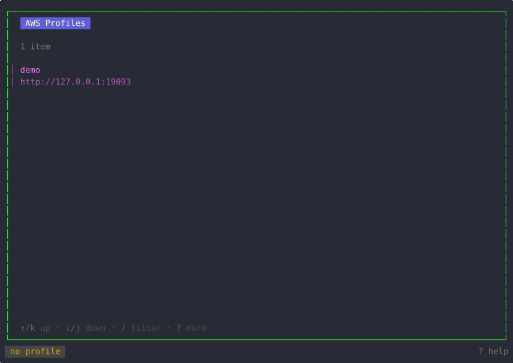

# lazys3

English | [简体中文](README.zh-CN.md)

A terminal UI for browsing and operating S3-compatible object storage (AWS S3, Aliyun OSS, MinIO, ...) like a file manager — dual-pane transfers, presigned URLs, versioning, and a persistent transfer history, all from the keyboard.



## Features

**Browse**

- Multi-profile: picks up every profile from `~/.aws/config` / `~/.aws/credentials`, including custom `endpoint_url` for S3-compatible services (MinIO, Aliyun OSS, Tencent COS, Ceph, ...)
- Path-style addressing is detected automatically: AWS S3 and Aliyun OSS use virtual-host style, every other custom endpoint gets path-style (OSS rejects path-style, so it is special-cased)
- Navigate profiles → buckets → objects with `enter`/`backspace` (or arrow keys); prefixes behave like directories
- Content preview (`p`): floating overlay with the first 256 KiB of the highlighted file (ranged fetch for S3 objects), scrollable, with binary- and empty-file detection
- Metadata overlay (`m`): every populated field of the highlighted item — full `HeadObject` for S3 objects (content type, ETag, storage class, user metadata, SSE, checksums, ...), region/versioning for buckets, path/permissions/owner/timestamps/symlink target for local entries, config paths for profiles
- Filter (`/`), sort by name/size/time (`o`/`O`), and multi-select (`space`, `a`) in every list

**Transfer**

- Dual-pane mode (`l`): local filesystem on one side, S3 on the other; `tab` switches focus and file ops act on the focused pane
- Upload (`u` in the local pane) and download (`d` in the remote pane), including recursive folder transfers through the sync engine
- Directory sync (`s`): local ⇄ S3 and S3 ⇄ S3; dual-pane prefills both sides
- Live transfers overlay (`t`) with progress bars, newest first; `x` cancels a running transfer
- Persistent transfer history (`T`) across sessions, stored as JSONL in `$XDG_STATE_HOME/lazys3/history.jsonl`

**Manage**

- Create buckets and local directories (`B`), rename (`r`), copy (`c`)
- Recursive delete (`D`): S3 folders (prefixes) and local directories, plus empty-bucket deletion — always behind a confirm modal
- Floating confirm modals with Yes/No buttons: `tab`/arrows move the highlight, `enter` executes it (Yes is the default), `y`/`n`/`esc` always work

**Versioning & sharing**

- Presigned share URLs (`Y`) with configurable expiry (1s..168h, default 1h), copied straight to the clipboard
- Object versions (`v`): download, restore, or delete a specific version
- Toggle bucket versioning (`V`): Enabled ⇄ Suspended
- Yank (`y`): the `s3://` URI of a bucket/object, or the absolute path of a local entry

**UX**

- Scrollable in-app help overlay (`?`) — the same keymap as the tables below
- Single-line status bar: active profile, focused pane, selection count, running/done/failed transfer tallies, last info/error
- Themeable colors and optional Nerd Font file icons via `config.yaml`
- A broken config file never crashes the TUI — invalid values fall back to defaults with a log line

## Keybindings

Press `?` inside lazys3 to see this list as a scrollable overlay.

### Global

| Key | Action |
|---|---|
| `q` | quit lazys3 |
| `ctrl+c` | force quit |
| `?` | toggle the help overlay |
| `t` | toggle the live transfers overlay (newest first, scrollable) |
| `T` | transfer history (persistent, across sessions) |
| `x` | cancel the most recent running transfer (transfers overlay: the highlighted one) |
| `l` | toggle dual-pane layout (local ⇄ remote, needs ≥80 cols) |
| `tab` | switch focus between remote and local panes (dual-pane) |
| `p` | preview file content (floating overlay, first 256 KiB) |
| `m` | object/file metadata (floating overlay; buckets and profiles too) |
| `enter` / `→` | open selected (profile → buckets → objects) |
| `backspace` / `←` | go back one level |
| `↑`/`k`, `↓`/`j` | move the list cursor (also scrolls the `?`/`t`/`T`/`v`/`p`/`m` overlays) |

### Remote pane (S3)

| Key | Action |
|---|---|
| `d` | download selected object(s); dual-pane: folders too, into the local directory |
| `u` | upload a local file to the current prefix (single-pane only; dual-pane hints to press `tab` — uploads run with local focus) |
| `D` | delete selected object(s); folders recursively (permanent) / empty bucket (bucket list) |
| `r` | rename selected object (copy + delete) |
| `c` | copy selected object to `s3://bucket/key` (dual-pane: to the local pane) |
| `B` | make bucket (bucket list; the object list only hints) |
| `s` | sync directory (local ⇄ s3, s3 ⇄ s3; dual-pane prefills both sides) |
| `y` | yank the highlighted bucket/object `s3://` URI to the clipboard |
| `Y` | generate presigned share URL (object files only) |
| `v` | object versions (download / restore / delete a version) |
| `V` | toggle bucket versioning (Enabled ⇄ Suspended, bucket list) |

### Local pane

| Key | Action |
|---|---|
| `u` | upload selection to the remote bucket/prefix (folders sync recursively) |
| `c` | copy selection to the remote pane (same as `u`) |
| `d` | hints to press `tab` (downloads run with remote focus) |
| `D` | delete selection (permanent, no trash; directories recursive) |
| `r` | rename the highlighted entry (same directory) |
| `B` | create a directory |
| `s` | sync directory: local pane → remote pane (prefilled, editable) |
| `y` | yank the highlighted entry's absolute path to the clipboard |

### Selection & filter

| Key | Action |
|---|---|
| `space` | toggle selection on the highlighted item |
| `a` | invert selection (select all ↔ none) |
| `/` | filter the focused list (`enter` applies, `esc` clears) |
| `o` | cycle sort field (name → size → time) |
| `O` | reverse sort direction |

### Overlays

| Key | Action |
|---|---|
| `pgup` / `pgdn` | scroll one page |
| `g` / `G` | jump to top / bottom (help, transfers, preview, metadata) |
| `esc` | close the overlay (lists: clear filter; modal: cancel) |

## Install

Requires Go 1.25+.

```sh
go install github.com/LinPr/lazys3@latest
```

Or build from source:

```sh
git clone https://github.com/LinPr/lazys3.git
cd lazys3
go build .          # or: task build
```

## Quick start

lazys3 reads the standard AWS shared config. Create `~/.aws/config` with one profile per storage account:

```ini
# ~/.aws/config
[default]
region = us-east-1

[profile oss]
region = cn-hangzhou
endpoint_url = https://oss-cn-hangzhou.aliyuncs.com
```

Credentials live in `~/.aws/credentials`:

```ini
# ~/.aws/credentials
[default]
aws_access_key_id = YOUR_ACCESS_KEY_ID
aws_secret_access_key = YOUR_SECRET_ACCESS_KEY

[oss]
aws_access_key_id = YOUR_ACCESS_KEY_ID
aws_secret_access_key = YOUR_SECRET_ACCESS_KEY
```

The `default` profile targets AWS S3; any profile with an `endpoint_url` targets that S3-compatible service (MinIO, Aliyun OSS, ...). Path-style vs. virtual-host addressing is chosen automatically per endpoint.

Then launch it:

```sh
lazys3
```

Pick a profile, press `enter` to list buckets, and press `?` any time for the full keymap.

## Configuration

lazys3 reads `$XDG_CONFIG_HOME/lazys3/config.yaml` (default `~/.config/lazys3/config.yaml`). On first run a commented template is written so the knobs are discoverable. Every key is optional; invalid values fall back to the built-in defaults with a log line.

```yaml
# lazys3 configuration.
# All keys are optional; the commented values show the built-in defaults.

theme:
  # Colors are hex strings: "#rgb", "#rrggbb" or "#rrggbbaa".
  # focused_border: "#20e71c"    # border of the focused pane
  # unfocused_border: "#555555"  # border of the unfocused pane (dual-pane mode)
  # title_fg: "#e39f00"          # status-bar profile chip foreground
  # title_bg: "#444745"          # status-bar profile chip background
  # status_error_fg: "#ffffff"   # status-bar error text
  # selected_fg: ""              # highlighted list row foreground

ui:
  # nerd_font: false             # render Nerd Font file icons (needs a patched font)
  # default_sort: "name"         # initial sort field: name | size | time
  # sort_desc: false             # sort descending by default

local:
  # start_dir: ""                # local pane start directory, "~" ok (default: process cwd)
```

Flags:

- `--config <path>` — read the lazys3 config from an explicit file instead of the default location (`lazys3 --config ./lazys3.yaml`); the file must exist, be readable and parse as YAML.
- `--aws-config <path>` — AWS shared config file (`lazys3 --aws-config ~/work/aws-config`); precedence: flag > `AWS_CONFIG_FILE` > `~/.aws/config`.
- `--aws-credentials <path>` — AWS shared credentials file (`lazys3 --aws-credentials ~/work/aws-credentials`); precedence: flag > `AWS_SHARED_CREDENTIALS_FILE` > `~/.aws/credentials`.

Notes:

- Older versions used `config.toml`; it is no longer read — rename it to `config.yaml` and convert the content to YAML syntax (a reminder is printed on stderr, and no template overwrites it).
- `local.start_dir` accepts `~` and relative paths (resolved against the launch directory); it must be an existing directory or it is ignored.
- `ui.transfer_panel_height` from older versions is deprecated and ignored — the bottom transfer panel was replaced by the full-screen transfers overlay (`t`). Old config files still load without error.

## License

MIT — see [LICENSE](LICENSE).

---

Contributing / development (build, tests, demo GIF): [docs/DEVELOPMENT.md](docs/DEVELOPMENT.md)
